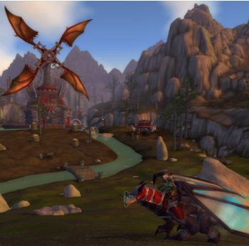

# Twin Peaks


## Description
This module add the Cataclysm battleground Twin Peaks on Wotlk 3.3.5a.

## How the battleground works?

This is a Capture The Flag (CTF), like **Warsong Gulch**, the players have to capture 3 flags to win.


## Requirements
This module requires
- Azerothcore v2+ from this [revision](https://github.com/azerothcore/azerothcore-wotlk/pull/2334).

## Installation
**Server-side**  
Install the module step by step:

```
1) Simply place the module mod-bg-twinpeaks under the `modules` directory of your AzerothCore source. 
2) Import the SQL manually to the right Database (auth, world or characters) or with the `db_assembler.sh` (if `include.sh` provided).
3) Re-run cmake and launch a clean build of AzerothCore.
```

The client data files like DBC, maps, vmaps and mmaps are in [client-data.zip](client-data.zip) in this repository.

Download the files and put them in your server/data/ folder, you need to overwrite the old dbc files and just add the others.

**Client-Side**  
You need to download the [patch-T.MPQ](https://mega.nz/#F!ksFzBSwI!FirOsvqp6cLvo8ShbvX6_Q?Mkt1QapC) and put it in your *WoW/Data/* folder or in your *WoW/Data/enUS/* folder.
In case that you want to put the patch file into *WoW/Data/enUS/* folder, you need to rename it to : **patch-enUS-4.MPQ**.
If you have a different client than enUS rename it with your client-lang name, for example for ruRU client put the patch in *WoW/Data/ruRU/* and rename it as **patch-ruRU-4.MPQ**.

>We recommand you to put the patch in *WoW/Data/* folder without renaming it, to prevent errors.

**The languages supported by this patch are: enUS, enGB, ruRU, frFR, deDe, esES, esMX.**

To use this patch correctly you need this wow.exe cracked version, you can take it using the following download links:  
- [windows version](https://mega.nz/#!Q5QR1SjJ!Arg1O1F7Mr5U6tE9aZcH0iFndYcGBK_AmfvZTn4kUjg)
- [mac version](https://mega.nz/#!c8IQXCab!PrUfJSS0OmrFJL1GASXIKY2_tLkdUsI95SJNbelont0)

## Credits

* [Helias](https://github.com/Helias)
* [Shard-MW](https://github.com/Shard-MW)

AzerothCore: [repository](https://github.com/azerothcore) - [website](http://azerothcore.org/) - [discord chat community](https://discord.gg/PaqQRkd)
